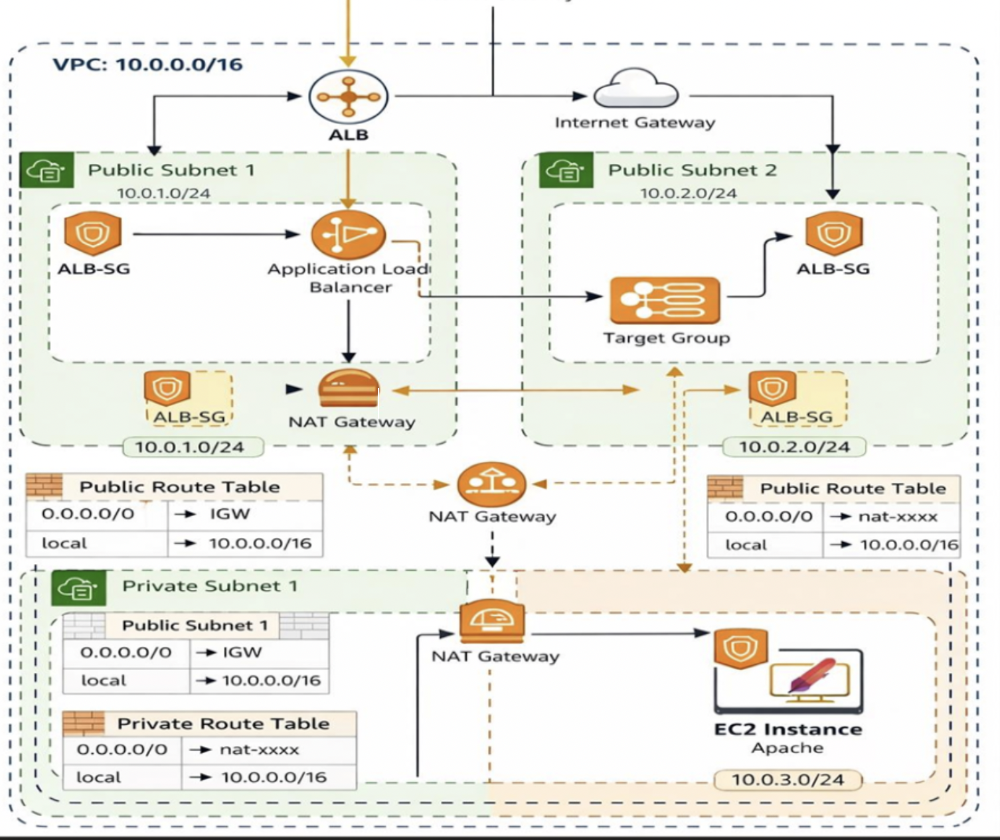
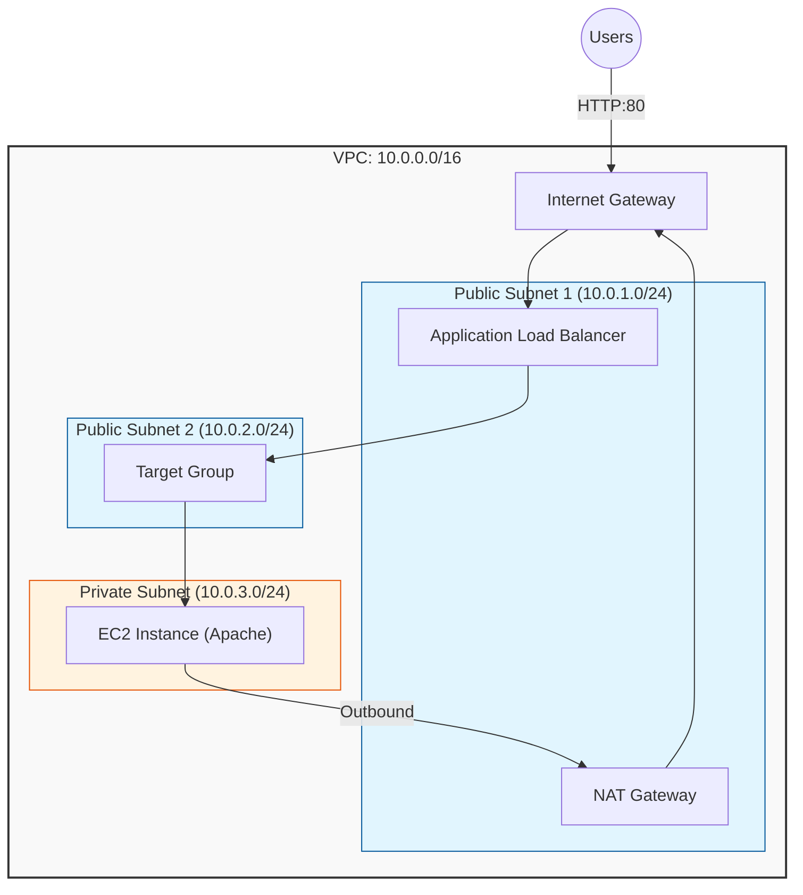

# AWS Networking Infrastructure with Terraform



## Architecture Diagram (Mermaid)




## Architecture Overview
The infrastructure includes:
- **VPC**: A Virtual Private Cloud with CIDR `10.0.0.0/16`.
- **Public Subnets**: Two public subnets in different Availability Zones for high availability of the Load Balancer.
- **Private Subnet**: One private subnet where the application (EC2 instance) resides.
- **Internet Gateway (IGW)**: Provides internet access for public subnets.
- **NAT Gateway**: Located in a public subnet to allow instances in the private subnet to access the internet (e.g., for software updates).
- **Application Load Balancer (ALB)**: Distributes incoming HTTP traffic across the EC2 instances.
- **EC2 Instance**: A web server running Apache in the private subnet.
- **Security Groups**:
    - `alb_sg`: Allows HTTP traffic (Port 80) from the internet.
    - `ec2_sg`: Allows HTTP traffic (Port 80) only from the ALB.

## Project Structure

```text
.
├── alb.tf              # Application Load Balancer and Target Group
├── ec2.tf              # EC2 instance and Target Group attachment
├── nat.tf              # NAT Gateway and Elastic IP
├── outputs.tf          # Terraform output variables (e.g., ALB DNS)
├── providers.tf        # AWS provider configuration
├── security_groups.tf  # Security Group definitions
├── variables.tf        # Variable definitions and defaults
└── vpc.tf              # VPC, subnets, IGW, and route tables
```

## Getting Started

### Prerequisites

- [Terraform](https://www.terraform.io/downloads.html) installed.
- AWS CLI configured with appropriate credentials.

### Deployment

1. **Initialize Terraform**:
   ```bash
   terraform init
   ```

2. **Check the Plan**:
   ```bash
   terraform plan
   ```

3. **Apply the Configuration**:
   ```bash
   terraform apply
   ```

## Verification

After the deployment is complete, Terraform will output the `alb_dns_name`. You can visit this URL in your browser to see the "Hello from Antigravity EC2 in Private Subnet" message.

